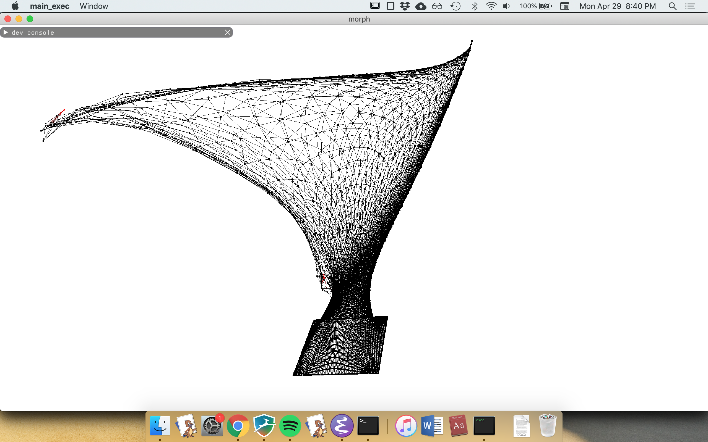
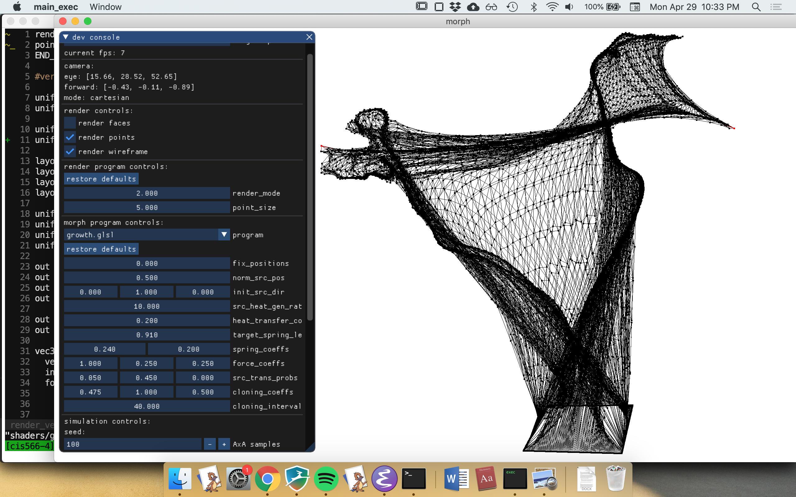
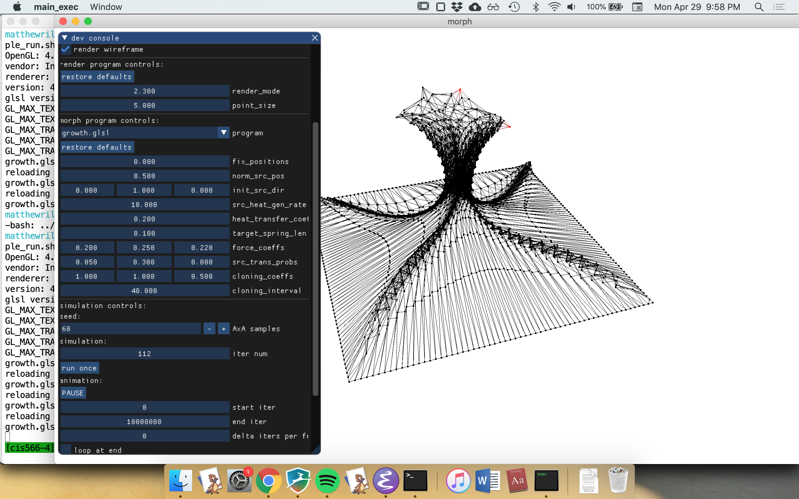
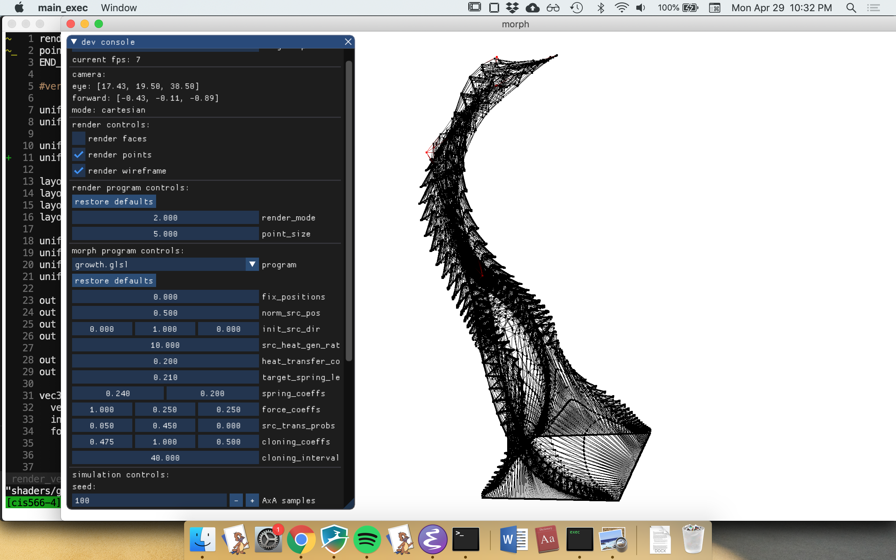
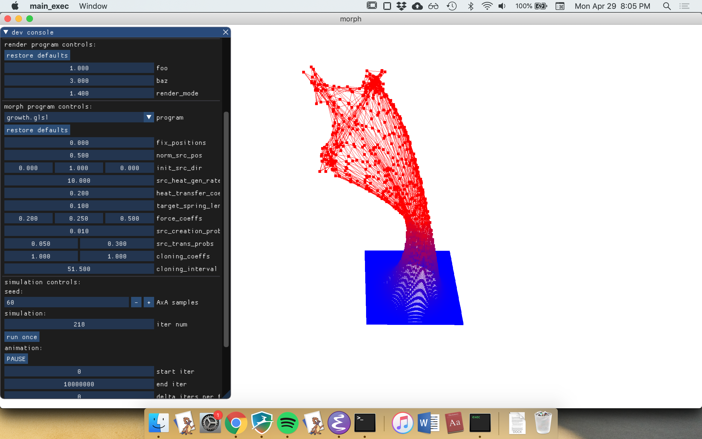
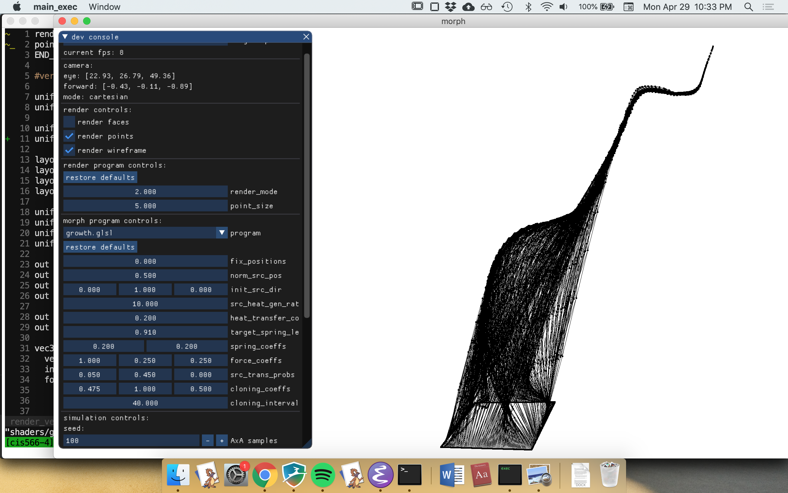
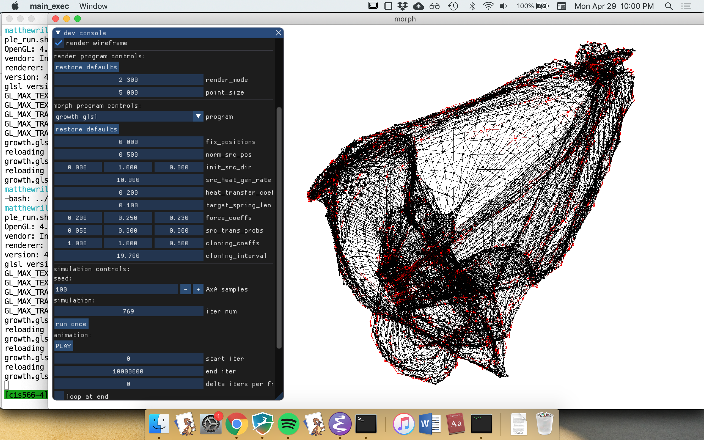

# CIS 566 Final Project - Procedural Mesh Generator

Matthew Riley \
matriley

# Demos

Animation of mesh generation: https://vimeo.com/333248430















# Setup
The project uses C++ and compiles with CMake. It depends on the GLFW3 library for windowing. The submodule commands below are required because I use a GUI library called ImGui which I compile to a static library directly from its source tree. To compile and launch the desktop app, run the following:

```
git clone https://github.com/mgriley/cis566_finalproj
cd cis566_finalproj
git submodule init
git submobule update
mkdir build
cd build
cmake ..
make
./main_exec ..
```

The argument for the executable is the path to the "shaders" folder (.. in this case).

# Quick-Start

Once the app opens, you should see a dev console window (you may need to resize and expand this) and a square mesh. Scroll to the bottom of the window for instructions.

# Overview

The app procedurally generates a mesh by simulating a cellular automaton. Each cell has a position, edges to neighboring cells, and some other data that will be described. Every iteration of the simulation, each cell changes its current position and data based on its own state and the state of its neighbors. No other information is available to it. My goal for the program was to generate a tree-like form. I did not achieve the distinct branches I hoped for. As you can see in the demo video and screenshots, the tree's branches are webbed instead of distinct. This is discussed in depth below. Nonetheless, some of the simulations yield interesting forms.

# How It Works

## Simulation Pipeline

The simulation is driven by transform feedback. We setup two VAOs for double-buffering. Each contains VBOs for the following arrays of vec4s: position, velocity, neighbors, and data. On my hardware (MacBook Pro Mid 2014), OpenGL permits no more than four separate transform feedback outputs, each with a max of four floating-point components. This limit forced me to squeeze all the state I could into the four vec4s, so the names can be misleading. To run a simulation, one of the buffers is loaded with seed data for a 2D plane. To allow each node to access the state of its neighbors, the VBOs are bound to texture buffers, too. Texture buffers allow us to query a VBO property by node index. At iteration 0, every node reads its attributes from buffers A and writes its outputs to buffer B. In iteration 1, buffer B is used as the input and we write to buffer A. And so on. Notably, between iterations no data is copied from the GPU to the CPU. This keeps things fast. Those same VBOs are used to render the nodes after the simulation is complete, again without copying any data from the GPU to the CPU. 

## The Editor

Scroll to the bottom of the dev console window in the app for instructions. Most importantly, you can run the simulation for some fixed number of iterations then render the result. You can also animate the simulation, which really runs the full simulation every frame but changes the target number of iterations run as it goes. This allows animating the simulation forwards or backwards. For convenience, the app reads the transform feedback and render shaders from a file called "shaders" (whose path is specified when you run the program from the command-line). You can reload the shaders from the app without closing the window or recompiling. You can also specify the names of uniforms in a special header in each shader file. The app parses the header and generates UI to set those uniforms. See "shaders/growth.glsl" for an example of this.

## Transition Function

The transition function is the function from a node's current state (and neighbor's state) to its next state. The transition function defines the behavior of the automaton. I designed the transition function with the goal of generating a tree. First, what is the initial state? We seed the automaton with a simple square grid, where each node has edges to the node right of, above, left of, and below it. We'd like our mesh to act a kind of stretchy skin while it deforms. Otherwise, we could get massive distances between neighboring nodes, creating grotesque geometry. To do this, each node computes its next position based on a sum of forces (not forces in a strict mechanics sense, but the same idea). The edges to neighbors act as a mass-spring system, which keeps the mesh looking intact as it grows. We can imagine rather crudely that at the tip of every tree-branch of a real tree there is a single cell that points out in which direction the branch should grow. The transition function works similarly. Certain nodes are designated as "source" nodes (as in source of growth). The xyz of their velocity vector contains a direction of growth. They experience a force in this direction. The effect is that the source node is compelled to move in its source direction, and its neighbors are pulled after it by spring forces. 

The simulation starts with a single source node in the center of the square grid that is compelled to grow straight up. This represents the trunk. If this were it, we'd get a kind of pyramidal shape as the one vertex pulled the mesh up, like pinching a point on a tablecloth and lifting it. We'd like the trunk to eventually branch off. To do this, a source node can clone itself into two source nodes. This mechanism uses the data vector. Usually the data vec4 contains all -1.0 values, but when a source node designates that it would like to clone, it sets data.w to the index of the edge upon which it would like to deliver a message. Note that the neighbors are ordered (right, above, left, below) in the neighbor vec, so data.w = 2.0 would specify a message for the left neighbor. data.xyz serves as the payload for the message. In this case it is the desired direction of the cloned source. Each iteration, every non-source node checks each of its neighbors for a message. If the message is intended for it (ex. node A leaves a message for edge 0 (right), and node A's right neighbor, node B, sees that its left neighbor, node A, has left node B a message), the non-source node will set its velocity vector to the payload and assume the role of a source. 

Now we have multiple sources. A source sets its payload such that its clone is guided in an opposing direction to it. But there is a complication. The clone is an immediate neighbor of its parent, so the two source nodes are left pulling on the one edge between them. No branching occurs. To fix this, we allow sources to traverse the mesh. This uses the same message-passing mechanism as cloning. If a source wants to move along its right edge, it leaves a message for its right neighbor (with the same payload as the clone message), and it sets its other state to that of a non-source node. After the message is read, the right neighbor will be the source, and the original source will be a regular node. We can now space apart the source nodes by having them move along the mesh in the direction most aligned with their desired growth direction, or perhaps in a random walk.

The major shortcoming of this method as a whole, and the reason for the webbed branches, concerns annealing. When a branch of a real tree grows, the trunk of the tree and the parent branches are largely fixed in place. At the least, the rate of growth of the slender branches exceeds that of the trunk. We can say that the trunk is annealed while the branches are still "hot". The tree conceptually adds more cells to the endpoints of the branches, in their general direction of growth. Our model is different. Instead of adding more nodes to the tips of our branches (at the sources), we pull the source nodes in their growth direction. When we have multiple sources, this pulling (rather than adding) gives a webbed structure instead of the tendril-like branch structure we would like. I tried one technique for fixing this, which helped, but it did not entirely eliminate the webbing. If we ran the simulation as currently described, the sources would pull the mesh up, so we'd have a very taunt region at the extremeties (near the sources), but many nodes clustering near the base. We'd instead like those nodes at the base to move towards the extremeties, simulating a kind of growth at those points. But how do the nodes at the base of the trunk or the base of a branch know where to move? Enter position.w. The source nodes emit a kind of "heat" that diffuses along the mesh surface. Each node stores its current heat in position.w. Only source nodes generate heat, and they store their heat generation rate in velocity.w. Every iteration, each node compares its current heat with the heat of its neighbors and calculates a heat-conserving transfer amount. To conserve heat, we guarentee that for every edge E from A to B, A calculates the heat transfer across E the same as B does. The result is a heat emanating from the sources. Each node experiences a force in the direction of the gradient of heat, moving them towards the sources.  

The heat propagation method is an improvement, but it's still disappointing. The trouble is that to get the structure of trunk supporting large branches that divide into yet small sub-branches, we must anneal the branches as they grow. You would do this by making low-heat nodes (far from any source, that is) disinclined to move. But you need those nodes to move, otherwise the spring system becomes taunt at the extremeties and growth halts. But by moving them you create the webbed structures: the trunk nodes move out of place along the trunk towards the source nodes, stretching into a web. It seems unworkable. I'm convinced that to really get this working you need to spawn nodes at the sources. Then, you can anneal cold nodes but still allow growth at the extremeties. With some cleverness I think it would be possible to use the message-passing system from earlier to expand a source node into a ring of regular nodes around the source node, modifying the source's neighbor vectors (via messaging) to effectively splice new nodes into the mesh. The setup would might look roughly as follows. When you load the VBOS, the first X nodes are all "active", but the last Y nodes are as of yet unused. In shared shader storage (unavailable on my hardware but perhaps there is an equivalent in Metal or Vulkan), you store a counter that is initialized to 0, and a fixed-size array (of, say, vec4s) of size Y. Every time an active node would like to "allocate" an inactive node, it atomically increments the counter. The resulting value is the unique address of a node in Y and the address of a location in shared storage. Since the counter is only every atomically incremented, no two nodes will ever get the same address. Our node can then place these new addresses in the messages to its neighbors, prompting them to rewire their neighbor vectors accordingly. The new node must also rewire its edges, though. To send it a message, we write to the unique address in shared shader storage assosciated with that node. Every iteration, each inactive node queries its address in shader storage for messages. That completes the communication. We would have to adjust the index buffers to include the new node in rendering, but that could be overcome.

## Sources

The OpenGL SuperBible has a nice chapter on how to make a mass-spring system using transform feedback. I referring to the example code that accompanies the book, here:

https://github.com/openglsuperbible/sb7code

