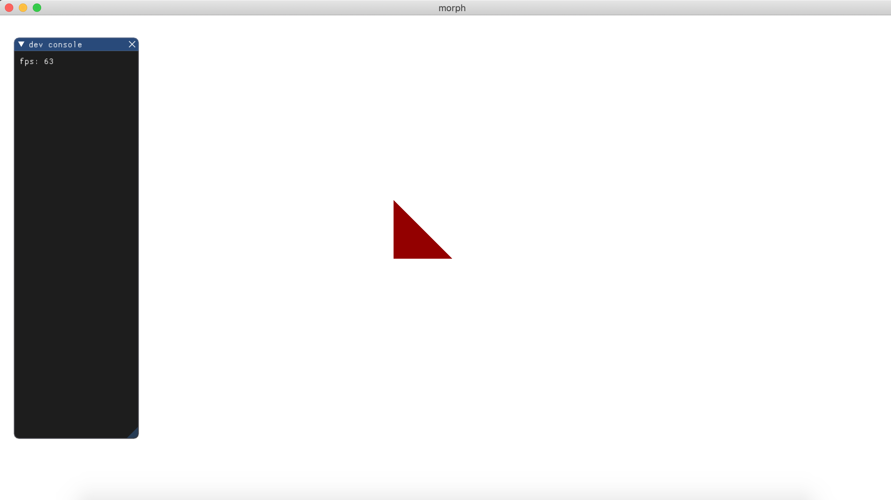

# cis566_finalproj
Final Project for CIS 566, Spring 2019

# Info
Matthew Riley
matriley

# Setup
The project uses C++ and compiles with CMake. It depends on the GLFW3 library for windowing. The submodule commands below are required because I use a GUI library called ImGui which I compile to a static library directly from its source tree. Full instructions:

```
git clone https://github.com/mgriley/cis566_finalproj
cd cis566_finalproj
git submodule init
git submobule update
mkdir build
cd build
cmake ..
make
./main_exec
```

# Midpoint Check-In
Running the above executable should produce a window resembling the one below. So far the project compiles and can render a triangle. Now that the general pipeline is setup I'll be able to focus on the interesting details. The bulk of the code is currently in src/app.cpp, but it is mostly boring OpenGL setup. Next, I will make a separate program whose role is to deform the data passed to it. Typically this program will operate on data that does not need to leave the GPU between iterations. But at a regular interval it will be copied to the CPU, converted to vertex data, and rendered using the render_program.


